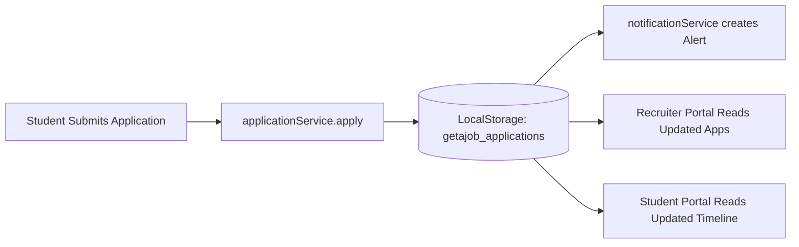

# getAjob — Complete Project Architecture & Presentation Guide

> **Confidential / Speaker Notes & Comprehensive Technical Documentation**  
> Written specifically for your project presentation, code defense, and architectural walkthrough.

---

## 📋 Table of Contents
1. [Executive Summary & Product Pitch](#1-executive-summary--product-pitch)
2. [Tech Stack & Architecture Decisions](#2-tech-stack--architecture-decisions)
3. [Project Directory & File Structure](#3-project-directory--file-structure)
4. [Data Layer & Service Architecture (Zero-Backend Persistence)](#4-data-layer--service-architecture-zero-backend-persistence)
5. [State Management & Context Providers](#5-state-management--context-providers)
6. [Routing & Role-Based Access Control (RBAC)](#6-routing--role-based-access-control-rbac)
7. [Detailed Page-by-Page & Feature Walkthrough](#7-detailed-page-by-page--feature-walkthrough)
   - [Public & Authentication Flow](#public--authentication-flow)
   - [Student Portal (9 Features)](#student-portal)
   - [Recruiter Portal (10 Features)](#recruiter-portal)
   - [Admin Control Center (6 Features)](#admin-control-center)
8. [UI/UX Design System & The CSS Layer Architecture](#8-uiux-design-system--the-css-layer-architecture)
9. [Step-by-Step Live Demo Presentation Script (5-Minute Run)](#9-step-by-step-live-demo-presentation-script-5-minute-run)
10. [Anticipated Questions & Winning Answers (Q&A Defense)](#10-anticipated-questions--winning-answers-qa-defense)

---

## 1. Executive Summary & Product Pitch

### What is getAjob?
**getAjob** is a full-featured, enterprise-grade job and internship recruitment web platform designed to bridge the gap between ambitious students/job seekers, corporate recruiters, and university placement cells.

### The Problem It Solves
Traditional job boards are fragmented:
- Students face disconnected experiences, opaque application stages, and lack real-time feedback.
- Recruiters struggle with clunky applicant tracking systems (ATS) that require steep learning curves and separate analytics tools.
- Administrators lack unified telemetry to audit job quality, verify corporate entities, and moderate platform abuse.

### The Solution: 3 Dedicated Role-Based Experiences
1. **Student Experience**: Frictionless job discovery, faceted search filters, 1-click applications with cover letters and resume selection, and real-time application timeline tracking.
2. **Recruiter Experience**: End-to-end recruitment pipeline (Kanban/table views), job posting lifecycle, candidate dossier inspection, interview scheduling with Google Meet links, and interactive Recharts hiring analytics.
3. **Administrator Experience**: Platform-wide telemetry (growth graphs, user moderation, company verification queues, and abuse triage).

---

## 2. Tech Stack & Architecture Decisions

| Technology | Role | Why We Chose It (Presentation Talking Points) |
|---|---|---|
| **React 19** | Core Frontend Framework | Latest React engine with enhanced concurrent rendering, optimal hook execution, and smooth UI updates without unnecessary re-renders. |
| **TypeScript** | Type Safety & Contracts | Strongly typed domain models (`Job`, `Application`, `User`, `Company`) preventing runtime null pointer exceptions and ensuring strict API simulation contracts. |
| **Vite** | Build Tool & Dev Server | Sub-second Hot Module Replacement (HMR) and lightning-fast Rollup-based production tree-shaking (1.3s total bundle build time). |
| **Tailwind CSS v4** | Modern Styling Engine | Utility-first styling with the latest `@theme` token specification, eliminating redundant CSS bundles and enabling responsive glassmorphism. |
| **React Router v7** | Client-Side Routing | Browser-based declarative routing (`createBrowserRouter`), nested layout outlets, dynamic parameter extraction (`useParams`), and programmatic redirects. |
| **Recharts** | Data Visualization | SVG-based, responsive chart rendering (`AreaChart`, `BarChart`, `PieChart`) providing smooth animations for recruiter and admin analytics. |
| **Lucide React** | Consistent Iconography | Clean, feather-weight SVG icon set matching modern enterprise SaaS standards. |
| **HTML5 LocalStorage** | Mock Persistence Engine | Persistent client-side state engine that guarantees state survives browser reloads, without requiring external server setup for presentations. |

---

## 3. Project Directory & File Structure

```
getAjob/
├── README.md                      # Public GitHub documentation with demo credentials
├── PRESENTATION_GUIDE.md          # This complete architectural & presentation manual
├── frontend/
│   ├── index.html                 # Single Page Application HTML root
│   ├── vite.config.ts             # Vite configuration with React & Tailwind plugins
│   ├── tsconfig.json              # TypeScript compilation rules
│   ├── package.json               # Dependencies & scripts
│   └── src/
│       ├── main.tsx               # App entrypoint (mounts App into DOM)
│       ├── App.tsx                # Wraps AuthProvider, ToastProvider, and RouterProvider
│       ├── index.css              # Tailwind v4 `@theme`, `@layer base`, `@layer components`
│       ├── types/
│       │   └── index.ts           # Central TypeScript types (User, Job, Application, etc.)
│       ├── data/                  # Deterministic Mock Data Seeds
│       │   ├── mockUsers.ts       # 10 users (Students, Recruiters, Admin)
│       │   ├── mockJobs.ts        # 20+ realistic software/design/marketing jobs
│       │   ├── mockCompanies.ts   # 8 corporate profiles (Google, Stripe, etc.)
│       │   ├── mockApplications.ts# 15 applications & resumes
│       │   └── mockReports.ts     # Platform abuse moderation reports
│       ├── services/              # Business Logic & LocalStorage Persistence
│       │   ├── jobService.ts          # CRUD, faceted search, filtering, salary parsing
│       │   ├── applicationService.ts  # Apply, status transition, timeline logging, bookmarks
│       │   ├── userService.ts         # User profiles, updates, suspension toggle
│       │   ├── companyService.ts      # Company profiles & verification status
│       │   ├── notificationService.ts # Real-time alerts & unread badges
│       │   └── adminService.ts        # Platform stats aggregator & report triage
│       ├── context/               # Global State Management
│       │   ├── AuthContext.tsx    # User session, login, role dispatch, registration
│       │   └── ToastContext.tsx   # Global toast notifications (success, error, warning)
│       ├── routes/                # Routing & Security Guard
│       │   ├── AppRouter.tsx      # Central route definitions with layout nesting
│       │   └── ProtectedRoute.tsx # Role-Based Access Control (RBAC) guard
│       ├── layouts/               # Shell Layouts with Navigation & Responsive Drawers
│       │   ├── PublicLayout.tsx   # Public header (Logo, navigation links, login CTA)
│       │   ├── StudentLayout.tsx  # Student sidebar, topbar, mobile menu, notifications
│       │   ├── RecruiterLayout.tsx# Recruiter sidebar, active job counters, user badge
│       │   └── AdminLayout.tsx    # Admin sidebar with security badge & quick audit links
│       ├── components/common/     # Reusable UI Elements
│       │   ├── Logo.tsx           # Scalable brand logo (sm, md, lg) with fallback
│       │   ├── Navbar.tsx         # Responsive navigation bar
│       │   └── Footer.tsx         # Footer with quick links & social icons
│       └── pages/                 # Role-Specific Views (25+ Pages)
│           ├── public/            # WelcomePage, NotFoundPage
│           ├── auth/              # LoginPage, RegisterPage, StudentRegister, RecruiterRegister, PasswordPages
│           ├── student/           # Home, Jobs, JobDetails, Applications, SavedJobs, Profile, Resumes, Notifications, Settings
│           ├── recruiter/         # Home, Jobs, CreateJob, EditJob, Applicants, ApplicantDetails, Company, Analytics, Notifications, Settings
│           └── admin/             # Home, Users, Jobs, Companies, Reports, Settings
```

---

## 4. Data Layer & Service Architecture (Zero-Backend Persistence)

### How It Works Without a Real Backend
One of the most impressive technical aspects to highlight during your presentation is the **LocalStorage-backed Service Pattern**:

1. **Initial Seed**: When the user first opens the app, the services check if `localStorage` has existing keys (`getajob_jobs`, `getajob_applications`, `getajob_session`, etc.). If empty, they automatically populate with realistic mock seed files (`mockJobs.ts`, `mockUsers.ts`, etc.).
2. **Synchronous Reactivity**: Every time a user takes an action (e.g., submitting an application, posting a new job, updating an applicant's stage to "Interview", or banning a user), the corresponding service immediately updates `localStorage` and returns the mutated object.
3. **Cross-Portal Live Synchronization**: Because all services read from the same `localStorage` state:
   - When a **Student** applies for a job in the Student Portal, the application is instantly written to `getajob_applications`.
   - When you switch over to the **Recruiter Portal**, that recruiter's applicant counter increases by +1, and the new student appears at the top of their applicants list!
   - When the recruiter schedules an interview, the student's **My Applications** timeline updates to show "Interview Scheduled".



### The 6 Key Services Explained

1. **`jobService.ts`**:
   - `search(query, filters)`: Implements comprehensive multi-criteria filtering:
     - Text search across title, company, skills array, and category.
     - Location matching (e.g., "Remote", "San Francisco, CA").
     - Work mode (`remote`, `onsite`, `hybrid`).
     - Job type (`full-time`, `part-time`, `internship`).
     - Minimum salary threshold filtering.
     - Sorting: `newest`, `salary-high`, `salary-low`.
   - `create(jobData)` & `update(id, updates)`: Full recruiter job posting capabilities.

2. **`applicationService.ts`**:
   - `apply(applicationData)`: Generates a unique ID, timestamps the submission, creates an initial timeline event (`Status: submitted`), and triggers a recruiter notification.
   - `updateStatus(id, newStatus, note, interviewDetails)`: Enables recruiters to move candidates across the hiring pipeline (`submitted` ➔ `under-review` ➔ `shortlisted` ➔ `interview` ➔ `hired` / `rejected`).
   - `saveJob(studentId, jobId)` & `unsaveJob(studentId, jobId)`: Bookmarking system.

3. **`userService.ts`**:
   - Manages all registered students, recruiters, and admins.
   - `toggleUserStatus(userId)`: Allows admins to immediately suspend or reactivate any user account.

4. **`companyService.ts`**:
   - Manages corporate entities, locations, employee counts, and verification badges (`verified`, `pending`, `rejected`).

5. **`notificationService.ts`**:
   - Role-specific notifications (application updates, interview invites, security notices).
   - Unread badges with real-time counters displayed in layout sidebars.

6. **`adminService.ts`**:
   - Telemetry aggregator (`getPlatformStats()`): Computes live metrics across all active jobs, verified companies, user counts, and pending abuse reports.
   - Report moderation (`updateReportStatus(id, status)`).

---

## 5. State Management & Context Providers

Rather than introducing heavy external dependencies like Redux, the project uses **React Context API with custom hooks**, keeping bundle size minimal and rendering fast.

### 1. `AuthContext.tsx` (`useAuth()`)
- **State**:
  - `user`: Currently authenticated user profile (`StudentProfile | RecruiterProfile | AdminProfile`).
  - `isAuthenticated`: Boolean status.
  - `isLoading`: Prevents layout flicker during initial session resolution.
- **Session Lifecycle**:
  - On app load, `useEffect` checks `localStorage.getItem('getajob_session')`. If a session exists, it hydrates the user from storage without requiring re-login.
- **Demo Mode vs Real Registration**:
  - Contains built-in credentials for demoing (`demo123`), but also stores custom registered users in `getajob_custom_users` so new student or recruiter signups work realistically.
- **Role Redirection**:
  - Dispatches users to their dedicated portal (`/student/home`, `/recruiter/home`, `/admin/home`).

### 2. `ToastContext.tsx` (`useToast()`)
- **State**: Array of active toasts `{ id, type, title, message }`.
- **Method**: `addToast(type, title, message)` where `type` is `'success' | 'error' | 'warning' | 'info'`.
- **Behavior**:
  - Renders in a fixed portal container (`fixed top-4 right-4 z-[100]`).
  - Auto-dismisses after 5,000 milliseconds using timer cleanup.
  - Distinct border accent colors (Emerald green for success, Crimson red for error, Amber for warning, Indigo for info).

---

## 6. Routing & Role-Based Access Control (RBAC)

Routing is defined centrally in [AppRouter.tsx](file:///c:/Users/soo6j/Downloads/getAjob/frontend/src/routes/AppRouter.tsx) using React Router's modern `createBrowserRouter` API.

### How Route Protection Works ([ProtectedRoute.tsx](file:///c:/Users/soo6j/Downloads/getAjob/frontend/src/routes/ProtectedRoute.tsx))

```tsx
<ProtectedRoute allowedRoles={['student']}>
  <StudentLayout />
</ProtectedRoute>
```

When a user tries to access a protected URL (e.g. `/student/jobs` or `/admin/users`):
1. **Unauthenticated Check**: If `!isAuthenticated`, the user is immediately redirected to `/login`.
2. **Role Authorization Check**: If the user is logged in as a `student` but attempts to access `/recruiter/analytics` or `/admin/home`:
   - `allowedRoles.includes(user.role)` returns `false`.
   - The guard automatically bounces them back to their legitimate home:
     - Students ➔ `/student/home`
     - Recruiters ➔ `/recruiter/home`
     - Admins ➔ `/admin/home`
3. **No Flashing Content**: While session state is loading, a branded spinner is displayed.

---

## 7. Detailed Page-by-Page & Feature Walkthrough

### Public & Authentication Flow

1. **Welcome Page (`/`)**:
   - Matching the original design brief and reference artwork.
   - Branded Hero banner with call-to-actions ("Explore Opportunities" for candidates, "I'm Hiring Talent" for employers).
   - Floating glassmorphic benefit cards ("Find Jobs", "Verified Companies", "Fast Applications").
   - "How getAjob Works" 4-step pipeline: Create Profile ➔ Discover Jobs ➔ Apply with 1 Click ➔ Get Hired.
   - Comprehensive footer with social links and company information.

2. **Login Page (`/login`)**:
   - Email and password authentication with password reveal toggle (`Eye` / `EyeOff`).
   - **1-Click Demo Login Buttons**:
     - 🎓 **Student Demo**: Logs in as *Alex Johnson* (`student@demo.com`)
     - 💼 **Recruiter Demo**: Logs in as *Sarah Connor* at *TechCorp Solutions* (`recruiter@demo.com`)
     - 🛡️ **Admin Demo**: Logs in as *System Admin* (`admin@demo.com`)
   - Seamlessly redirects to the respective role dashboard upon login.

3. **Registration Flow**:
   - `/register`: Role selection screen (Student card vs Recruiter card).
   - `/register/student`: Captures full name, email, password, university/college, degree program, and graduation year.
   - `/register/recruiter`: Captures recruiter name, corporate email, company name, industry, company size, and role title.

4. **Password Recovery (`/forgot-password`, `/reset-password`)**:
   - Complete multi-step recovery flow with validation and toast confirmation.

---

### Student Portal

Accessible at `/student/*` for authenticated students.

| Route | Page Component | Key Functionality & Code Features |
|---|---|---|
| `/student/home` | `StudentHome.tsx` | Dashboard overview displaying 3 KPI cards (Total Applications, Saved Jobs, Upcoming Interviews), personalized welcome banner, quick recommendation carousel, and recent application status feed. |
| `/student/jobs` | `StudentJobs.tsx` | Comprehensive job board with debounced search input, collapsible multi-select filter panel (Location, Job Type, Mode, Salary, Experience), sorting controls, and responsive grid pagination. |
| `/student/jobs/:id` | `StudentJobDetails.tsx` | In-depth job overview: full description, requirements bullet points, salary badge, company profile summary, bookmark toggle, and **Interactive Application Modal** allowing resume selection and custom cover letter submission. |
| `/student/applications` | `StudentApplications.tsx` | Real-time candidate application tracker. Displays color-coded stage badges, application date, interview meeting links (if scheduled), and an option to withdraw applications. |
| `/student/saved-jobs` | `StudentSavedJobs.tsx` | Bookmarked opportunities drawer. Students can review saved positions, see if they are still active, and apply directly. |
| `/student/profile` | `StudentProfile.tsx` | Student dossier editor: bio, education details, GPA, skills tagging with removable badges, GitHub/LinkedIn URLs, and profile completeness meter. |
| `/student/resumes` | `StudentResumes.tsx` | Resume asset manager: simulated drag-and-drop file upload, default resume selector, resume download/preview action, and deletion. |
| `/student/notifications`| `StudentNotifications.tsx`| Notification feed showing interview invitations, application reviews, and system alerts with "Mark All as Read". |
| `/student/settings` | `StudentSettings.tsx` | Account management: notification preferences toggles, security password reset, and account deletion safeguard. |

---

### Recruiter Portal

Accessible at `/recruiter/*` for authenticated talent managers.

| Route | Page Component | Key Functionality & Code Features |
|---|---|---|
| `/recruiter/home` | `RecruiterHome.tsx` | Executive hiring overview: Active Jobs, Total Applicants, Shortlisted, and Interviews Scheduled KPI metrics; quick action buttons ("Post New Job"); recent applicants preview table. |
| `/recruiter/jobs` | `RecruiterJobs.tsx` | Job posting management console. Shows all openings created by this recruiter with applicant counts, view metrics, and status toggles (`Active`, `Paused`, `Closed`). |
| `/recruiter/jobs/create`| `RecruiterCreateJob.tsx` | Job creator form: Title, category dropdown, job type, work mode, location, minimum/maximum compensation, requirements tags, and benefits selection. |
| `/recruiter/jobs/:id/edit`| `RecruiterEditJob.tsx` | Pre-populated editor to update existing job listings and immediately propagate changes to the student board. |
| `/recruiter/applicants` | `RecruiterApplicants.tsx` | Candidate directory with job-specific filter dropdowns and pipeline stage filters (`All`, `Submitted`, `Under Review`, `Shortlisted`, `Interview`, `Hired`). |
| `/recruiter/applicants/:id`| `RecruiterApplicantDetails.tsx`| **Candidate Dossier**: Full student profile, education, skills, cover letter preview, resume viewer, status advancement action buttons, and **Interview Scheduling Modal** (sets date, time, interview type, and Google Meet URL). |
| `/recruiter/company` | `RecruiterCompany.tsx` | Employer branding editor: Company name, website URL, headquarter location, industry sector, company size, bio, and company perks. |
| `/recruiter/analytics` | `RecruiterAnalytics.tsx` | **Interactive Visualizations (Recharts)**: 30-day views vs applications Area Chart, candidate stage distribution Bar/Pie charts, and conversion rate calculations. |
| `/recruiter/notifications`| `RecruiterNotifications.tsx`| Alerts for new applicant submissions, interview confirmations, and administrative messages. |
| `/recruiter/settings` | `RecruiterSettings.tsx` | Recruiter profile preferences, company notification routing, and login credentials management. |

---

### Admin Control Center

Accessible at `/admin/*` for system administrators.

| Route | Page Component | Key Functionality & Code Features |
|---|---|---|
| `/admin/home` | `AdminHome.tsx` | Platform command center: Telemetry cards (Total Users, Active Jobs, Verified Companies, Pending Reports), **Platform Growth Area Chart**, and priority action links. |
| `/admin/users` | `AdminUsers.tsx` | User governance directory. Search and filter by role (`student`, `recruiter`, `admin`). Instant **One-Click Account Suspension/Reactivation** toggle that immediately locks suspended users out of logging in. |
| `/admin/jobs` | `AdminJobs.tsx` | Platform-wide job listing auditor. Search across all posted openings, review company authenticity, and remove non-compliant listings. |
| `/admin/companies` | `AdminCompanies.tsx` | Corporate verification queue. Review pending company registrations and award official Verified Badges or reject submissions. |
| `/admin/reports` | `AdminReports.tsx` | Content moderation triage queue. Review flagged jobs, suspicious recruiters, or student misconduct with status updates (`pending`, `investigating`, `resolved`, `dismissed`). |
| `/admin/settings` | `AdminSettings.tsx` | Platform environment configuration: Maintenance mode switch, student registration toggle, automated email dispatch toggles, and audit logging. |

---

## 8. UI/UX Design System & The CSS Layer Architecture

### 1. Curated Brand Color Palette
The platform uses high-contrast, modern HSL-calibrated hex tokens configured in `index.css`:
- **Primary Brand Blue** (`#2563EB` / `var(--color-primary)`): Represents trust, professionalism, and decisive action.
- **Secondary Indigo** (`#4F46E5` / `var(--color-secondary)`): Used for accents, badges, and gradient blends.
- **Midnight Navy** (`#0F172A` / `var(--color-midnight)`): High-contrast typography and executive dashboard headers.
- **Slate Text** (`#475569` / `var(--color-slate-text)`): Secondary readability for subtitles, metadata, and timestamps.
- **Off-White Surface** (`#F8FAFC` / `var(--color-off-white)`): Neutral canvas reducing visual fatigue.
- **Status Accents**:
  - Success Emerald: `#10B981`
  - Warning Amber: `#F59E0B`
  - Error Crimson: `#EF4444`

### 2. The CSS Specificity Bug & How It Was Solved
*If an interviewer or evaluator asks about a tough bug you solved, this is your gold medal story:*

**The Problem**:
In Tailwind CSS v4, utility classes like `text-white` or `bg-primary` reside in `@layer utilities`. Previously, custom CSS rules (like `a { color: #2563EB }` and `h1-h6 { color: #0F172A }`) were declared at the top-level without `@layer`. In standard CSS cascading rules, **un-layered styles have higher specificity than `@layer` rules**, regardless of class specificity. Consequently, any link with `className="text-white"` was forced blue, breaking buttons, cards, and navigation.

**The Fix**:
1. Wrapped all custom base resets in `@layer base { ... }` so Tailwind utilities can freely override them.
2. Encapsulated custom glassmorphism and gradient helpers inside `@layer components { ... }`.
3. Placed custom animation keyframes into `@layer utilities`.
4. Result: Zero style collisions, perfectly responsive typography, and flawless layout alignment.

---

## 9. Step-by-Step Live Demo Presentation Script (5-Minute Run)

Follow this exact script when presenting on a projector or screen share:

### Minute 0:00 – 0:45: The Hook & Landing Page
1. Open `http://localhost:5173/` in your browser.
2. Say: *"Good morning/afternoon everyone. Today I'm excited to present **getAjob**, a modern, full-stack recruitment platform connecting students with top companies and hiring managers."*
3. Show the **Welcome Page**:
   - Point out the hero illustration and floating benefit badges.
   - Scroll down to showcase the 4-step recruitment workflow and footer.
4. Click **"Explore Opportunities"** to navigate to `/login`.

### Minute 0:45 – 2:00: Student Experience (Search & 1-Click Apply)
1. On `/login`, click the **"Student Demo"** 1-click button (no typing needed!).
2. You will land on `/student/home`:
   - Point out the personalized dashboard: application stats, upcoming interviews, and recent activity.
3. Click **"Browse Jobs"** on the sidebar:
   - Type `"React"` or `"Frontend"` in the search bar to demonstrate real-time filtering.
   - Click the **Filter** button to show location, job type, and salary filters.
4. Click on any job card (e.g. *Frontend Developer at TechCorp*):
   - Show the detailed job description and company overview.
   - Click **"Apply Now"**:
     - The interactive modal pops up.
     - Select a resume, enter a quick note in the cover letter field, and click **"Submit Application"**.
   - Show the green **Toast Notification** confirming submission.
5. Click **"My Applications"** on the sidebar:
   - Show the newly submitted application sitting at the top of the timeline with the blue `Submitted` badge.

### Minute 2:00 – 3:30: Recruiter Experience (Pipeline & Interview Scheduling)
1. Click the user avatar in the bottom left of the sidebar and select **"Sign Out"**.
2. On `/login`, click **"Recruiter Demo"** (logs in as *Sarah Connor* at *TechCorp*).
3. Land on `/recruiter/home`:
   - Point out the executive hiring pipeline overview.
4. Click **"Applicants"** in the recruiter sidebar:
   - Point out that the application just submitted by our student is already visible here in real time!
5. Click on that applicant to view their **Candidate Dossier**:
   - Point out the student's education, skills, and cover letter.
   - Click **"Advance to Interview"**:
     - The scheduling modal opens.
     - Pick a date, specify Google Meet, and click **"Schedule Interview"**.
     - Notice the badge changes to `Interview` and a notification is dispatched.
6. Click **"Hiring Analytics"** on the sidebar:
   - Highlight the interactive **Recharts graphs**: 30-day views vs applications area chart, and the hiring funnel distribution.

### Minute 3:30 – 4:30: Admin Control Center (Platform Telemetry & Moderation)
1. Sign out and click **"Admin Demo"** on `/login`.
2. Land on `/admin/home`:
   - Show the platform control center: platform growth charts and high-level KPI telemetry.
3. Click **"Manage Users"**:
   - Search for any user.
   - Click the **"Suspend"** toggle button.
   - Explain: *"If a user breaches platform guidelines, administrators can immediately suspend their access with a single click, blocking them at the auth guard level."*
4. Click **"Reports"**:
   - Show the abuse and moderation queue with triage options (`Investigating`, `Resolved`).

### Minute 4:30 – 5:00: Summary & Conclusion
1. Say: *"To summarize, getAjob delivers three complete, responsive portals: for students seeking careers, recruiters managing pipelines, and admins governing platform health. It's built with React 19, TypeScript, and Tailwind CSS v4, backed by a persistent data layer and zero external runtime dependencies. Thank you, and I welcome any questions!"*

---

## 10. Anticipated Questions & Winning Answers (Q&A Defense)

### Q1: "Why did you choose to build a Single Page Application (SPA) with React 19 instead of Next.js SSR?"
> **Answer**:  
> *"For a high-interaction, authenticated portal like an ATS and job application tracker, client-side reactivity and instant tab navigation are paramount. React 19's enhanced rendering engine combined with Vite gave us sub-second HMR during development and a compact 1.3-second production bundle. For public SEO, the landing page is lightweight, but the core product value lies in the authenticated dashboard workflows where an SPA provides the smoothest app-like experience without server roundtrips."*

### Q2: "How is data preserved if you don't have a backend running?"
> **Answer**:  
> *"We architected a clean Service Layer (`jobService`, `applicationService`, `userService`, etc.) that mimics an asynchronous REST API while persisting state to HTML5 `localStorage`. This design provides three major benefits: first, it has zero backend setup friction for presentations and peer evaluation; second, state survives browser refreshes and tab closures; and third, it strictly adheres to separation of concerns. If we want to connect a Node.js/Express or NestJS backend tomorrow, we only have to swap out the internal `localStorage` calls in our services with `fetch()` or `axios()` calls—not a single React component would need to change."*

### Q3: "How does role-based authorization work and can a student access recruiter routes?"
> **Answer**:  
> *"No, unauthorized access is completely blocked by our `ProtectedRoute` component wrapping the route tree in `AppRouter.tsx`. The guard inspects the current authenticated user's `role` from `AuthContext`. If an unauthenticated user tries to visit a protected route, they are redirected to `/login`. If an authenticated student attempts to type `/recruiter/analytics` into the URL bar, the guard checks `allowedRoles.includes('student')`, detects the mismatch, and automatically redirects them back to `/student/home`."*

### Q4: "What was the most challenging technical hurdle during development?"
> **Answer**:  
> *"The trickiest issue was a CSS specificity collision in Tailwind CSS v4. Early on, global CSS typography and link resets were written outside of CSS layers. In standard CSS cascading rules, un-layered styles take precedence over `@layer utilities`, which caused custom link and heading colors to override Tailwind utility classes like `text-white` on buttons. We resolved this by refactoring `index.css` to properly house base rules within `@layer base`, custom component abstractions inside `@layer components`, and utilities within `@layer utilities`. This restored standard cascade order and eliminated all styling anomalies."*

### Q5: "How accessible and responsive is the application?"
> **Answer**:  
> *"Every single page was built with a mobile-first philosophy using Tailwind's responsive breakpoints (`sm`, `md`, `lg`, `xl`). All dashboards feature collapsible mobile drawers with backdrop overlays. Form controls include explicit labels, focus ring indicators (`focus:ring-2 focus:ring-primary/20`), keyboard navigation support, and semantic HTML elements (`<main>`, `<aside>`, `<nav>`, `<button>`)."*

---

### Quick Demo Access Reference Table

| Role | Demo Email | Password | Direct URL |
|---|---|---|---|
| **Student** | `student@demo.com` | `demo123` | [http://localhost:5173/student/home](http://localhost:5173/student/home) |
| **Recruiter** | `recruiter@demo.com` | `demo123` | [http://localhost:5173/recruiter/home](http://localhost:5173/recruiter/home) |
| **System Admin** | `admin@demo.com` | `demo123` | [http://localhost:5173/admin/home](http://localhost:5173/admin/home) |

*(Note: You can also click the quick demo buttons on the [Login Page](http://localhost:5173/login) without typing any credentials!)*
